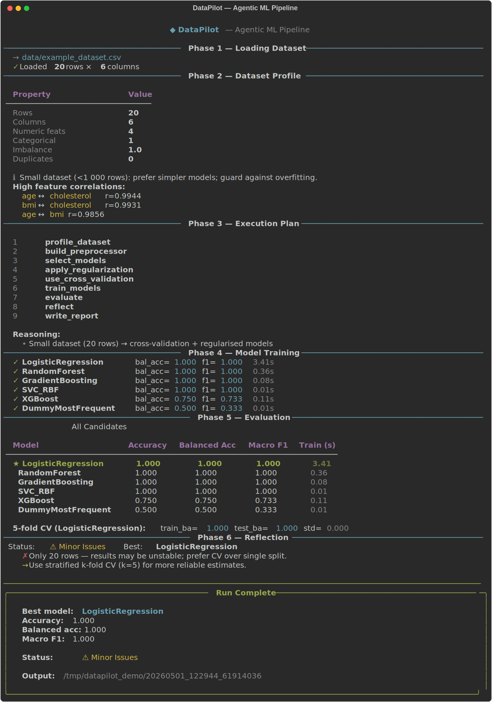
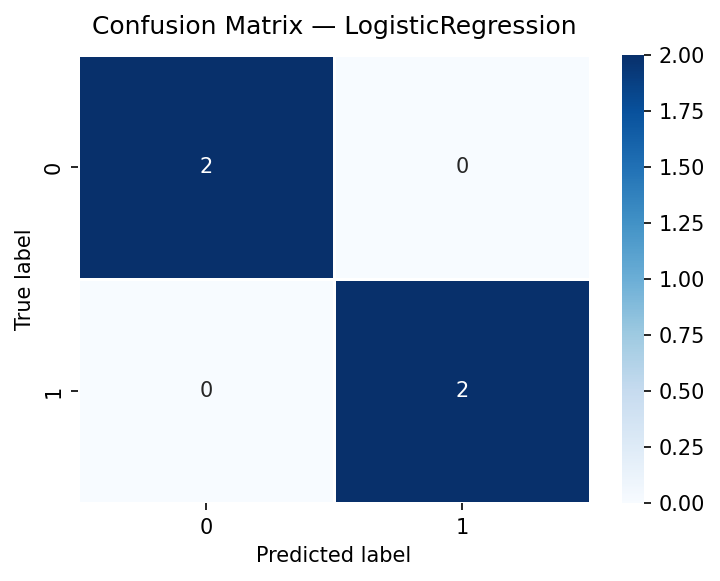
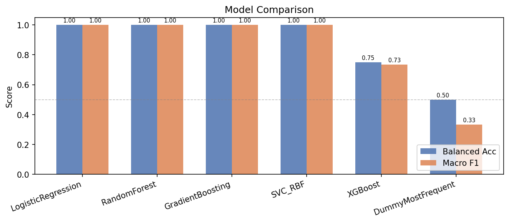

# DataPilot — Autonomous ML Pipeline

An **offline, agentic ML pipeline** that autonomously profiles your dataset, builds a context-aware execution plan, trains multiple classifiers, evaluates them, reflects on the results, and optionally replans — all from a single command, with a beautiful Rich terminal UI.


---

## Demo



| Confusion Matrix | Model Comparison |
|:---:|:---:|
|  |  |

---

## What It Does

```
CSV dataset
    │
    ▼
┌─────────────────────────────────────────────────────┐
│  1. Profile      Deep EDA: missing, imbalance,      │
│                  correlations, outliers, duplicates  │
│  2. Plan         Context-aware step list (size,      │
│                  imbalance, cardinality, memory)     │
│  3. Preprocess   Median imputation + scaling +       │
│                  one-hot encoding                    │
│  4. Train        LogReg · RF · GBM · XGBoost · SVC  │
│                  Optional 5-fold CV                  │
│  5. Evaluate     Metrics table + confusion matrix    │
│                  + model comparison chart            │
│  6. Reflect      Baseline lift · overfitting probe   │
│                  · class-collapse detection          │
│  7. Replan       Adaptive: inject SMOTE, feature     │
│                  engineering, regularisation ...     │
│  8. Memory       JSON store: fingerprint → best      │
│                  model carries over to future runs   │
└─────────────────────────────────────────────────────┘
    │
    ▼
outputs/<run_id>/
    ├── report.md
    ├── confusion_matrix.png
    ├── model_comparison.png
    ├── eda_summary.json
    ├── plan.json
    ├── metrics.json
    └── reflection.json
```

---

## Quick Start

```bash
# 1. Clone
git clone https://github.com/<you>/agentic-data-scientist.git
cd agentic-data-scientist

# 2. Install
pip install -r requirements.txt

# 3. Run (interactive prompts if flags are omitted)
python cli.py --data data/demo.csv --target label

# With cross-validation and 2 replan cycles
python cli.py --data data/demo.csv --target auto --cv --max_replans 2
```

---

## CLI Reference

```
python cli.py [OPTIONS]

Options:
  --data         PATH    Path to CSV dataset (interactive prompt if omitted)
  --target       STR     Target column name, or 'auto' to infer
  --output_root  DIR     Root directory for run artefacts  [default: outputs]
  --seed         INT     Random seed                       [default: 42]
  --test_size    FLOAT   Test split fraction (0-1)         [default: 0.2]
  --max_replans  INT     Max replan cycles                 [default: 1]
  --cv                   Enable 5-fold CV on best model
  --debug                Show full tracebacks on error
```

Alternatively, use the legacy `run_agent.py` for pure CLI without the Rich UI:

```bash
python run_agent.py --data data/demo.csv --target label --quiet
```

---

## Project Structure

```
agentic-data-scientist/
├── cli.py                      # Rich terminal UI (primary entry point)
├── run_agent.py                # Legacy argparse entry point
├── datapilot.py                # DataPilot orchestrator + event/callback system
│
├── agents/
│   ├── planner.py              # Context-aware execution plan generator
│   ├── reflector.py            # Result analysis + replan decision
│   └── memory.py               # JSON-backed persistent memory
│
├── tools/
│   ├── data_profiler.py        # Deep EDA (correlations, outliers, duplicates)
│   ├── modelling.py            # Model selection, training, CV
│   └── evaluation.py           # Metrics, charts, markdown report
│
├── data/
│   ├── demo.csv                # Tiny smoke-test dataset
│   └── example_dataset.csv     # Larger sample
│
├── tests/
│   ├── test_smoke_run.py
│   └── sanity_check.py
│
├── requirements.txt
├── pyproject.toml
└── README.md
```

---

## Models Trained

| Model | Notes |
|-------|-------|
| DummyMostFrequent | Baseline — must be beaten |
| LogisticRegression | Fast linear baseline |
| RandomForest | 200 trees, sqrt features |
| GradientBoosting | 150 trees, depth 4 — skipped on >100k rows |
| **XGBoost** | 200 trees, colsample, subsample — included when available |
| SVC (RBF) | Included for small datasets (≤15k rows, ≤150 cols) |

Class imbalance (`ratio ≥ 3×`) automatically sets `class_weight='balanced'` and `scale_pos_weight`.

---

## Planning Logic

The planner reads the dataset profile and injects extra steps when needed:

| Condition | Action |
|-----------|--------|
| `rows < 1 000` | Cross-validation + regularisation |
| `rows > 200 000` | Fast models only (no SVC / full GBM) |
| `imbalance ≥ 3×` | `consider_imbalance_strategy` |
| `imbalance ≥ 10×` | `apply_severe_imbalance_strategy` |
| `missing > 10%` | Dedicated imputation step |
| High-cardinality categoricals | Target encoding step |
| `cols > 100` | Feature selection step |
| Memory hit | Prioritise previously best model |

---

## Reflection & Replanning

After each training cycle the reflector scores results on:

- **Baseline lift** — balanced accuracy vs dummy
- **Model spread** — diversity across all candidates
- **Absolute F1 / balanced accuracy** thresholds
- **Per-class collapse** — classes with zero recall
- **Overfitting gap** — train vs CV test score (when `--cv` is set)
- **Data quality** — residual missing rate, small-dataset instability

A **severity score 0–3** is computed. If `severity >= 2` a replan is recommended and the pipeline injects the appropriate fix (SMOTE, regularisation, feature engineering, etc.) for another cycle.

---

## Persistent Memory

Each run fingerprints the dataset (`shape|target|columns → hash`) and records the best model + metrics in `agent_memory.json`. On subsequent runs with the same data the planner gets a "memory hint" that promotes the previously successful model to the front of the candidate list.

---

## Running Tests

```bash
pytest tests/ -v
```

---

## Key Concepts (Interview Prep)

| Concept | Where it appears |
|---------|-----------------|
| Agentic loop | `AgenticDataScientist.run()` — plan → act → reflect → replan |
| Chain-of-thought planning | `agents/planner.py` — rule-based conditional tree |
| Reflection / self-critique | `agents/reflector.py` — severity scoring + replan trigger |
| Persistent memory | `agents/memory.py` — JSON fingerprint store |
| Preprocessing pipeline | `tools/modelling.py` — sklearn `Pipeline` + `ColumnTransformer` |
| Class imbalance | `class_weight='balanced'`, `scale_pos_weight` |
| Cross-validation | `StratifiedKFold` with `cross_validate` |
| Event-driven UI | `on_event` callback in orchestrator → Rich renderer in `cli.py` |

---

## Contributing

1. Fork → feature branch → PR
2. Keep functions focused; no class should own more than one responsibility
3. All new logic must be covered by at least a smoke test
4. Run `black . && ruff check .` before opening a PR

---

## License

MIT — see [LICENSE](LICENSE).
